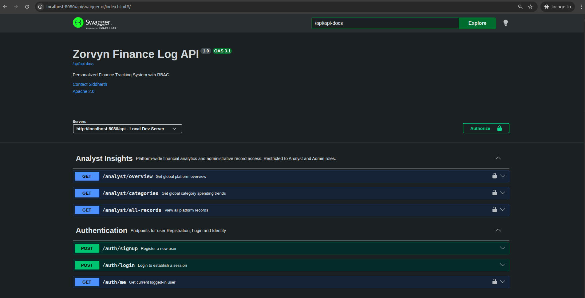

# 🏦 Zorvyn Finance Log
**A Professional, Role-Based Financial Tracking & Analytics System**

[](https://spring.io/projects/spring-boot)
[](https://www.oracle.com/java/)
[](https://opensource.org/licenses/Apache-2.0)

## 📖 Overview
The **Zorvyn Finance Log** is a backend-driven financial management platform designed to handle personal transactions with enterprise-level security and data integrity. Unlike basic CRUD apps, this system implements **Advanced Role-Based Access Control (RBAC)** and a **Soft-Delete Data Migration pattern** to ensure financial history is never lost.

---

## 🚀 Key Technical Highlights
* **3-Tier RBAC System:** Granular security filters separating **Viewers** (Read-only), **Analysts** (Global Aggregates), and **Admins** (User Lifecycle Management).
* **Intelligent Data Integrity:** Implemented a **Soft-Delete fallback mechanism**. When a category is deleted, all associated records are automatically migrated to a system-managed `Miscellaneous` category instead of being orphaned.
* **Dynamic Filtering Engine:** Powered by **JPA Specifications (Criteria API)**, allowing for complex, multi-parameter searches (Date Range + Type + Category) without repository bloat.
* **Stateless Security & Session Management:** Configured multi-chain Spring Security to handle secure session-based authentication with custom `AccessDenied` handling.
* **Standardized API Layer:** Every response is wrapped in a consistent `APIResponse<T>` DTO, providing unified status codes, timestamps, and error messaging.

---

## 🛠️ Tech Stack
* **Core:** Java 17, Spring Boot 3.2+
* **Security:** Spring Security (Session-based RBAC)
* **Persistence:** Spring Data JPA, MySQL 8.0, Hibernate
* **Mapping:** MapStruct (Entity-to-DTO decoupling)
* **Documentation:** OpenAPI 3 / Swagger UI
* **Build Tool:** Maven

---

## 📸 API Documentation (Swagger UI)
The system is fully documented using OpenAPI 3, providing an interactive sandbox to test all roles and endpoints.

> **Access Link:** `http://localhost:8080/swagger-ui/index.html` (Local)
> *Note: Please ensure you are logged in via `/auth/login` to access restricted Analyst and Admin endpoints.*



---

## 🔐 Role-Based Access Matrix

| Feature | Viewer | Analyst | Admin |
| :--- | :---: | :---: | :---: |
| View Own Records | ✅ | ✅ | ✅ |
| Create/Edit Records | ❌ | ❌ | ✅ |
| View Global Insights | ❌ | ✅ | ✅ |
| User Management | ❌ | ❌ | ✅ |

---

## 🛣️ API Endpoint Summary

### 🔑 Authentication
* `POST /auth/signup` - Public registration.
* `POST /auth/login` - Establish session (JSESSIONID).
* `GET /auth/me` - Current user profile.

### 💰 Finance Records
* `GET /records` - Search with dynamic filters (Date range, Category, Type).
* `GET /records/summary` - Totals (Income, Expense, Balance) based on current filters.
* `GET /records/recent` - Last 5 activities.
* `POST /records` - Create new entry (Defaults to 'Miscellaneous' if category is null).

### 📊 Analyst Insights (Global)
* `GET /analyst/overview` - Platform-wide volume totals.
* `GET /analyst/categories` - Global spending trends by category.
* `GET /analyst/all-records` - Full platform audit trail.

### 🛡️ Admin Controls
* `PATCH /admin/users/{id}/status` - Enable/Disable/Lock user accounts.
* `GET /admin/users` - Search and audit platform users.

---

## ⚙️ How to Run Locally
1. **Clone the Repository:**
   ```bash
   https://github.com/siddharthmsingh2001/zorvyn-dashboard.git
2. **DB Setup:**
   ```bash
   Create a MySQL database
3. **Configure:**
   ```bash
   Update src/main/resources/application.properties with DB credentials.
4. **Run:**
   ```bash
   mvn spring-boot:run
5. **Access Swagger UI**
   ```bash
   http://localhost:8080/api/swagger-ui/index.html#/